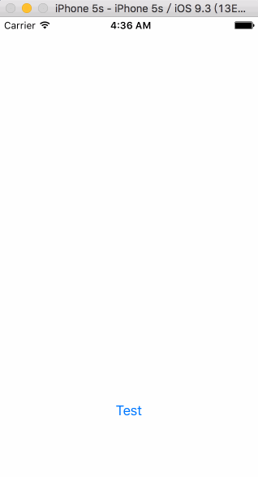

# UIPresentationController 显示控制器
> UIPresentationController是iOS 8新加入一个类，能帮助我们方便快捷地实现ViewController的自定义过渡效果。

## 自定义过渡动画
第一，通过继承UIPresentationController类的子类和一个遵从UIViewControllerAnimatedTransitioning协议的类，实现自定义过渡效果

- 继承UIPresentationController类的子类负责「被呈现」的控制器的显示操作，在我们的例子里，它负责的是带透明效果的背景button，并实现点击dismiss

- 而遵从UIViewControllerAnimatedTransitioning协议的类负责「被呈现」的控制器的过渡动画

第二，「被呈现」的控制器设置`modalPresentationStyle`为`Custom`并且设置`transitioningDelegate`代理，实现代理的方法。

首页，新建一个类CustomPresentationController，继承之UIPresentationController
我们需要重写其中5个方法：

1. presentationTransitionWillBegin
2. presentationTransitionDidEnd:
3. dismissalTransitionWillBegin
4. dismissalTransitionDidEnd:
5. frameOfPresentedViewInContainerView


1）presentationTransitionWillBegin是在呈现过渡即将开始的时候被调用的。我在这个方法中把懒加载的透明btnView加入到containerView中，添加点击监听，并且做一个alpha从0到1的渐变过渡动画。

```swift
// 呈现过渡即将开始时候调用
override func presentationTransitionWillBegin() {
 
   guard
       let containerView = containerView
   else {
       return
   }
   
   dimmingView.frame = containerView.bounds
   dimmingView.addTarget(self, action: #selector(self.btnClick), forControlEvents: .TouchUpInside)
   
   // 将透明btnView添加到容器视图中
   containerView.addSubview(dimmingView)
   
   // 通过使用「负责呈现」的 controller 的 UIViewControllerTransitionCoordinator，我们可以确保我们的动画与其他动画一快播放。
   if let transitionCoordinator =  presentingViewController.transitionCoordinator() {
       transitionCoordinator.animateAlongsideTransition({ (context: UIViewControllerTransitionCoordinatorContext!) in
           self.dimmingView.alpha = 0.5
       }, completion: nil)
   }
}
```

2）presentationTransitionDidEnd: 是在呈现过渡结束时被调用的，并且该方法提供一个布尔变量来判断过渡效果是否完成。在我们的例子中，我们在它过渡效果已结束但没有完成时移除透明的btnView。

```swift
// 呈现过渡完成时候调用
override func presentationTransitionDidEnd(completed: Bool) {
   // 如果呈现没有完成，就移除背景view
   if !completed {
       print("呈现没有完成")
       dimmingView.removeFromSuperview()
   }
}
```

上面是view的呈现部分，我们现在要做的是淡出并且移除它。

3) dismissalTransitionWillBegin是消失过渡即将开始的时候调用，正是我们把它的 alpha 重新设回0的地方。

```swift
// 消失过渡即将开始的时候调用
override func dismissalTransitionWillBegin() {
   // 与过渡效果一起执行背景view的淡出效果
   if let transitionCoordinator = presentingViewController.transitionCoordinator() {
       transitionCoordinator.animateAlongsideTransition({ (context) in
           self.dimmingView.alpha = 0
       }, completion: nil)
   }
}
```

4) 我们还需要在消失完成后移除btnView。做法与上面 presentationTransitionDidEnd: 类似，我们重载 dismissalTransitionDidEnd: 方法

```swift
// 消失过渡完成的时候调用
override func dismissalTransitionDidEnd(completed: Bool) {
   // 如果消失没有完成，那么把背景view移除
   if !completed {
       print("消失没有完成")
       dimmingView.removeFromSuperview()
   }
}
```

5）在我们自定义呈现中，被呈现的view并没有完成的充满整个屏幕，而是一个小的矩形。而这个被呈现的view过渡动画之后的最终位置，就是由UIPresentationViewController的frameOfPresentedViewInContainerView方法里定义的。

```swift
override func frameOfPresentedViewInContainerView() -> CGRect {
   
   guard
       let containerView = containerView
   else {
       print("获取不到")
       return CGRect()
   }
   
   var frame = containerView.bounds
   print(frame)
   frame = CGRectInset(frame, 50, 200)
   print(frame)
   
   return frame
}
```

6) 实现按钮的点击监听方法，对呈现出来的控制器进行dismiss

```swift
@objc private func btnClick() {
        self.presentedViewController.dismissViewControllerAnimated(true, completion: nil)
    }
```

至此，我们完成了通过定义UIPresentationController类的重写。如果我们没有遵从UIViewControllerAnimatedTransitioning协议，那么会用系统默认的过渡动画来呈现。

接下来我们新建一个「被呈现」的控制器类，设置`modalPresentationStyle`为`Custom`并且设置`transitioningDelegate`代理，实现代理的`presentationControllerForPresentedViewController:`方法。代码如下：

```swift
import UIKit

class PresentedViewController: UIViewController {
    
    override func viewDidLoad() {
        super.viewDidLoad()
        self.view.backgroundColor = UIColor.blueColor()
    }
    
    override init(nibName nibNameOrNil: String?, bundle nibBundleOrNil: NSBundle?) {
        super.init(nibName: nibNameOrNil, bundle: nibBundleOrNil)
        commonInit()
    }
    
    required init?(coder aDecoder: NSCoder) {
        super.init(coder: aDecoder)
        commonInit()
    }
    
    func commonInit() {
        print("commoninit")
        self.modalPresentationStyle = .Custom
        self.transitioningDelegate = self
    }
}

extension PresentedViewController: UIViewControllerTransitioningDelegate {
    
    // 返回一个负责过渡的对象
    func presentationControllerForPresentedViewController(presented: UIViewController, presentingViewController presenting: UIViewController, sourceViewController source: UIViewController) -> UIPresentationController? {
        
        if presented == self {
            return CustomPresentationController(presentedViewController: presented, presentingViewController: presenting)
        } else {
            return nil
        }
    }
}
```

最终运行效果如下（默认为系统的过渡动画）：




下一篇我们将对系统默认的过渡动画进行自定义。文中的案例工程文件将在下一篇中提供。

（本文参见英文原文：[iOS8 presentation controllers](http://dativestudios.com/blog/2014/06/29/presentation-controllers/)，作者:Pete Callaway）

