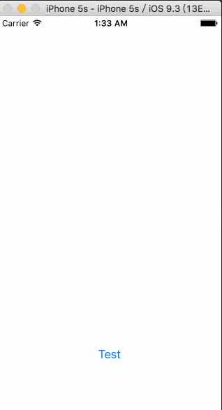

# UIPresentationController 显示控制器
> UIPresentationController是iOS 8新加入一个类，能帮助我们方便快捷地实现ViewController的自定义过渡显示效果。

## 自定义过渡动画
第一，通过继承UIPresentationController类的子类和一个遵从UIViewControllerAnimatedTransitioning协议的类，实现自定义过渡效果

- 继承UIPresentationController类的子类负责「被呈现」的控制器的显示操作，在我们的例子里，它负责的是带透明效果的背景button，并实现点击dismiss

- 而遵从UIViewControllerAnimatedTransitioning协议的类负责「被呈现」的控制器的过渡动画

第二，「被呈现」的控制器设置`modalPresentationStyle`为`Custom`并且设置`transitioningDelegate`代理，实现代理的方法。

首页，新建一个类CustomPresentationController，继承之UIPresentationController
我们需要重写其中5个方法：

1. presentationTransitionWillBegin
2. presentationTransitionDidEnd:
3. dismissalTransitionWillBegin
4. dismissalTransitionDidEnd:
5. frameOfPresentedViewInContainerView


1）presentationTransitionWillBegin是在呈现过渡即将开始的时候被调用的。我在这个方法中把懒加载的透明btnView加入到containerView中，添加点击监听，并且做一个alpha从0到1的渐变过渡动画。

```swift
// 呈现过渡即将开始时候调用
override func presentationTransitionWillBegin() {
 
   guard
       let containerView = containerView
   else {
       return
   }
   
   dimmingView.frame = containerView.bounds
   dimmingView.addTarget(self, action: #selector(self.btnClick), forControlEvents: .TouchUpInside)
   
   // 将透明btnView添加到容器视图中
   containerView.addSubview(dimmingView)
   
   // 通过使用「负责呈现」的 controller 的 UIViewControllerTransitionCoordinator，我们可以确保我们的动画与其他动画一快播放。
   if let transitionCoordinator =  presentingViewController.transitionCoordinator() {
       transitionCoordinator.animateAlongsideTransition({ (context: UIViewControllerTransitionCoordinatorContext!) in
           self.dimmingView.alpha = 0.5
       }, completion: nil)
   }
}
```

2）presentationTransitionDidEnd: 是在呈现过渡结束时被调用的，并且该方法提供一个布尔变量来判断过渡效果是否完成。在我们的例子中，我们在它过渡效果已结束但没有完成时移除透明的btnView。

```swift
// 呈现过渡完成时候调用
override func presentationTransitionDidEnd(completed: Bool) {
   // 如果呈现没有完成，就移除背景view
   if !completed {
       print("呈现没有完成")
       dimmingView.removeFromSuperview()
   }
}
```

上面是view的呈现部分，我们现在要做的是淡出并且移除它。

3) dismissalTransitionWillBegin是消失过渡即将开始的时候调用，正是我们把它的 alpha 重新设回0的地方。

```swift
// 消失过渡即将开始的时候调用
override func dismissalTransitionWillBegin() {
   // 与过渡效果一起执行背景view的淡出效果
   if let transitionCoordinator = presentingViewController.transitionCoordinator() {
       transitionCoordinator.animateAlongsideTransition({ (context) in
           self.dimmingView.alpha = 0
       }, completion: nil)
   }
}
```

4) 我们还需要在消失完成后移除btnView。做法与上面 presentationTransitionDidEnd: 类似，我们重载 dismissalTransitionDidEnd: 方法

```swift
// 消失过渡完成的时候调用
override func dismissalTransitionDidEnd(completed: Bool) {
   // 如果消失没有完成，那么把背景view移除
   if !completed {
       print("消失没有完成")
       dimmingView.removeFromSuperview()
   }
}
```

5）在我们自定义呈现中，被呈现的view并没有完成的充满整个屏幕，而是一个小的矩形。而这个被呈现的view过渡动画之后的最终位置，就是由UIPresentationViewController的frameOfPresentedViewInContainerView方法里定义的。

```swift
override func frameOfPresentedViewInContainerView() -> CGRect {
   
   guard
       let containerView = containerView
   else {
       print("获取不到")
       return CGRect()
   }
   
   var frame = containerView.bounds
   print(frame)
   frame = CGRectInset(frame, 50, 200)
   print(frame)
   
   return frame
}
```

6) 实现按钮的点击监听方法，对呈现出来的控制器进行dismiss

```swift
@objc private func btnClick() {
        self.presentedViewController.dismissViewControllerAnimated(true, completion: nil)
    }
```

## UIViewControllerAnimatedTransitioning 
上面我们介绍了UIPresentationController的使用，由于UIPresentationController的加入，UIViewControllerAnimatedTransitioning 类可以比之前少做一些事了，现在，它只负责与呈现相关的ViewController的View的动画了，其他额外的View一概不管了，比如我们的透明背景的btnView。

首先我们新建一个类CustomPresentationAnimationController遵守UIViewControllerAnimatedTransitioning协议

我们需要实现协议里的两个协议方法：

1. transitionDuration:
2. animatedTransition:

1）transitionDuration:这个方法里，我们返回一个动画的持续时长

2）animatedTransition:方法中，我们给被呈现的view添加呈现与消失的动画

代码如下：

```swift
import UIKit

class CustomPresentationAnimationController: NSObject, UIViewControllerAnimatedTransitioning {
    
    let isPresenting: Bool
    let duration: NSTimeInterval = 0.5
    
    init(isPresenting: Bool) {
        self.isPresenting = isPresenting
        super.init()
    }
    
    // 过渡动画执行时间
    func transitionDuration(transitionContext: UIViewControllerContextTransitioning?) -> NSTimeInterval {
        return duration
    }
    
    // 过渡动画效果
    func animateTransition(transitionContext: UIViewControllerContextTransitioning) {
        
        if isPresenting {
            animatePresentationWithTransitionContext(transitionContext)
        } else {
            animateDismissWithTransitionContext(transitionContext)
        }
    }
    
    // MARK - 内部实现方法
    
    private func animatePresentationWithTransitionContext(transitionContext: UIViewControllerContextTransitioning) {
        
        guard
            let presentedController = transitionContext.viewControllerForKey(UITransitionContextToViewControllerKey),
            let presentedControllerView = transitionContext.viewForKey(UITransitionContextToViewKey),
            let containerView = transitionContext.containerView()
        else {
            return
        }
        
        // 定位被呈现的view一开始位置，在屏幕顶部
        presentedControllerView.frame = transitionContext.finalFrameForViewController(presentedController)
        presentedControllerView.center.y -= containerView.bounds.size.height
        
        containerView.addSubview(presentedControllerView)
        
        UIView.animateWithDuration(duration, delay: 0.0, usingSpringWithDamping: 1.0, initialSpringVelocity: 0.0, options: .AllowUserInteraction, animations: { 
            presentedControllerView.center.y += containerView.bounds.size.height
        
        }) { (completed: Bool) in
            // 完成一定要调用此方法告诉系统动画完成
            transitionContext.completeTransition(completed)
        }
    }
    
    private func animateDismissWithTransitionContext(transitionContext: UIViewControllerContextTransitioning) {
        
        guard
            // 这里的key要注意是UITransitionContextFromViewKey，因为当被呈现的控制器呈现出来后，当前的控制器的view相对的就是fromViewKey。
            let presentedControllerView = transitionContext.viewForKey(UITransitionContextFromViewKey),
            let containerView = transitionContext.containerView()
        else {
            return
        }
        
        UIView.animateWithDuration(duration, delay: 0.0, usingSpringWithDamping: 1.0, initialSpringVelocity: 0.0, options: .AllowUserInteraction, animations: {
                presentedControllerView.center.y += containerView.bounds.size.height
            
            }) { (completed) in
                transitionContext.completeTransition(completed)
        }
    }
}
```

至此，我们完成了通过定义UIPresentationController类的重写。如果我们不自定义遵从UIViewControllerAnimatedTransitioning协议，那么会用系统默认的过渡动画来呈现。

我们看看要怎么使用它们，事实上，有许多种不同的方法实现它们，最简单的方式还是让「被呈现」的ViewController来作为UIViewControllerTransitioningDelegate

新建一个被呈现的控制器类：PresentedViewController

实现代码如下：

```swift
import UIKit

class PresentedViewController: UIViewController {
    
    override func viewDidLoad() {
        super.viewDidLoad()
        self.view.backgroundColor = UIColor.blueColor()
    }
    
    override init(nibName nibNameOrNil: String?, bundle nibBundleOrNil: NSBundle?) {
        super.init(nibName: nibNameOrNil, bundle: nibBundleOrNil)
        commonInit()
    }
    
    required init?(coder aDecoder: NSCoder) {
        super.init(coder: aDecoder)
        commonInit()
    }
    
    func commonInit() {
        print("commoninit")
        self.modalPresentationStyle = .Custom
        self.transitioningDelegate = self
    }
}

extension PresentedViewController: UIViewControllerTransitioningDelegate {
    
    // 返回一个负责过渡的外观对象
    func presentationControllerForPresentedViewController(presented: UIViewController, presentingViewController presenting: UIViewController, sourceViewController source: UIViewController) -> UIPresentationController? {
        
        if presented == self {
            return CustomPresentationController(presentedViewController: presented, presentingViewController: presenting)
        } else {
            return nil
        }
    }
    
    func animationControllerForPresentedController(presented: UIViewController, presentingController presenting: UIViewController, sourceController source: UIViewController) -> UIViewControllerAnimatedTransitioning? {
        
        if presented == self {
            return CustomPresentationAnimationController(isPresenting: true)
        } else {
            return nil
        }
    }
    
    func animationControllerForDismissedController(dismissed: UIViewController) -> UIViewControllerAnimatedTransitioning? {
        
        if dismissed == self {
            return CustomPresentationAnimationController(isPresenting: false)
        } else {
            return nil
        }
    }
}```

我们在viewController中modal控制器

```swift
import UIKit

class ViewController: UIViewController {
    override func viewDidLoad() {
        
    }

    @IBAction func buttomClick(sender: UIButton) {
        self.presentViewController(PresentedViewController(), animated: true, completion: nil)
    }
}
```

最终我们运行效果如下（自定义动画效果）：



（本文参见英文原文：[iOS8 presentation controllers](http://dativestudios.com/blog/2014/06/29/presentation-controllers/)，作者:Pete Callaway）


